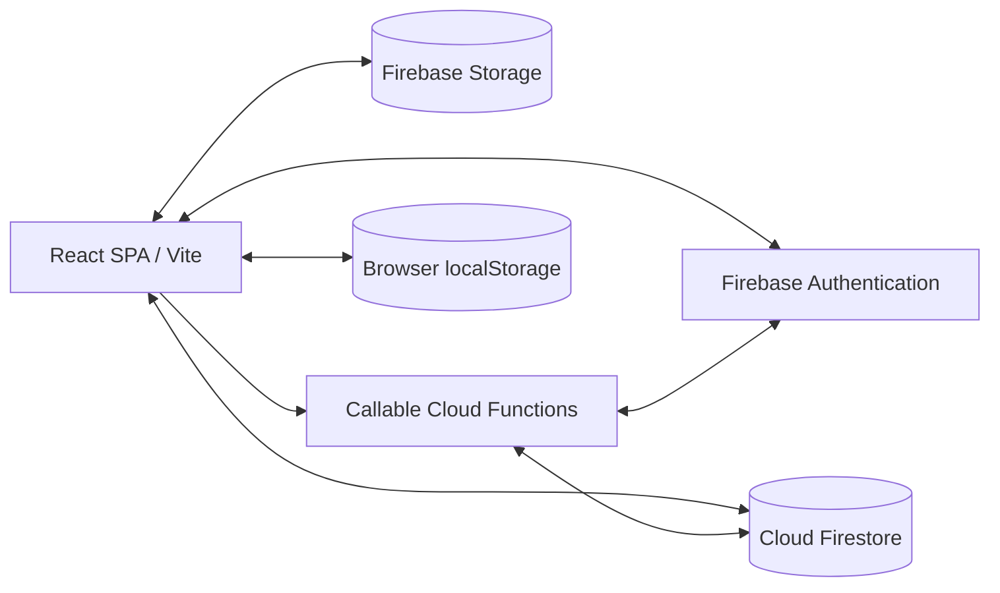

# Wedding Planner — Project Architecture

**Architecture snapshot:** 2026-10-05  
**Purpose:** Source-oriented guide to the active application architecture. Repository configuration does not, by itself, prove which version is deployed or which Firebase project is live.

## 1. Overview

Wedding Planner is a Hebrew, right-to-left (RTL) single-page application built with React and Vite. In cloud mode, Firebase Authentication provides identity, Cloud Firestore stores structured wedding data, Firebase Storage stores files, and callable Cloud Functions perform privileged operations. The browser also uses namespaced localStorage for responsive editing and continuity. Local-only mode is available when Firebase is not configured.



## 2. Technology and entry points

- React 19, JSX, and Vite 8; Tailwind CSS 4 and Lucide React for the interface.
- Firebase Web SDK for authentication, Firestore, Storage, and callable functions.
- Firebase Functions use Node.js 22 and are initialized in `europe-west1` by the client.
- ExcelJS supports workbook import/export. Playwright is used for browser tests.
- `src/main.jsx` is the UI entry point, `src/App.jsx` owns most screen and sync orchestration, and `src/index.css` contains global styles and design tokens.
- `src/lib/firebase.js`, `firebaseAuth.js`, `firebaseStore.js`, and `entityMap.js` contain Firebase initialization, auth helpers, data operations, and entity serialization.

## 3. Firebase configuration and environments

The client reads `VITE_FIREBASE_*` values from its build environment. These values identify the Firebase Web app and are public; access control must not depend on hiding them. `VITE_FIREBASE_ENV` selects the logical `test` or `prod` namespace used in Firestore and Storage paths. It does not isolate Authentication, Functions, billing, or project-level configuration.

The root `firebase.json` configures Firestore rules, Storage rules, Functions, and local emulators. It does not configure Firebase Hosting. Static frontend hosting is configured separately; `public/_headers` provides security headers for compatible static hosts.

`FIREBASE_SERVICE_ACCOUNT` is for trusted local administration and migration scripts only. Its credential file must remain private and must never be exposed through a `VITE_` variable or included in a client build.

## 4. Application features

### Guests and seating

Guest records include contact details, category, seats, notes, source, dietary and attendance flags, drinker count, RSVP, gifts, and attendance count. The guest screen supports search, sorting, filtering, bulk actions, category management, import, and export. Seating is managed separately with tables and guest assignments. At desktop widths, a column chooser controls optional table fields; visibility preferences are persisted per wedding and do not modify guest records. Smaller screens use guest cards.

### Other screens

- **Dashboard:** summaries and shortcuts to the screens that own editable data.
- **Vendors:** vendor details, tasks, budget links, and cloud file attachments.
- **Budget:** expected, actual, and paid amounts, gifts, goals, labels, and vendor links.
- **Checklist:** categorized, assignable wedding tasks.
- **Settings and sharing:** wedding basics, invitations, member roles/scopes, and passkeys.
- **Alcohol calculator:** guest drinker estimates and beverage quantity/cost planning.

The UI is navigation-state driven rather than organized as URL routes. Accessible modal helpers and guided tours live in `src/hooks/` and `src/components/`.

## 5. Data model and synchronization

Application records are namespaced below `envs/{env}`. Wedding-scoped collections include `members`, `guests`, `tables`, `vendors`, `budget`, `checklist`, `files`, and `settings`. Environment-scoped records include users, invitations, passkeys, WebAuthn challenges, and migration markers. See `src/lib/firebase.js` for path helpers and `src/lib/entityMap.js` for document mappings.

Cloud startup restores Firebase Authentication, resolves wedding membership and access scopes, and loads permitted data. Screens update application state and localStorage; debounced Firestore writes and snapshot listeners synchronize changes. Entity revisions and conflict checks help prevent stale writes from silently replacing newer records. Some privileged membership, invitation, passkey, and claim operations use callable Functions with the Admin SDK.

localStorage is a working cache, not a durable cloud backup. Cloud keys are namespaced by user and wedding. Importing eligible local-only data into a cloud wedding requires an explicit user action.

## 6. Security boundaries

- `firestore.rules` protects direct client reads and writes using authentication, wedding membership, role, and scope.
- `storage.rules` protect uploaded objects. Environment-specific custom claims are synchronized by trusted Functions for Storage authorization.
- Callable Functions must validate identity, role, scope, and request data because Admin SDK operations bypass client security rules.
- The interface may hide unavailable actions for usability, but this is not an authorization boundary.
- Client configuration is public. Private service-account credentials and other administrative secrets must remain server-side or in trusted local tooling.

Review rule and function changes with direct SDK/emulator tests, including owner, editor, viewer, scope, invitation, and Storage access cases. A repository snapshot is not evidence that deployed rules or functions match the current source.

## 7. Backups and files

- JSON backup supports restore; optional encryption uses PBKDF2-SHA-256 and AES-GCM. A lost passphrase cannot be recovered.
- XLSX and guest CSV exports are intended for reading and data workflows.
- Vendor attachment bytes are stored in Firebase Storage and are not embedded in the data backup. Confirm file-retention and restore needs separately.
- Restore replaces application data and offers a safety download before replacement; validate backup contents before using restore on important data.

Relevant modules include `src/lib/backupCrypto.js`, `src/lib/excelExport.js`, `src/lib/guestImport.js`, and backup/restore handlers in `src/App.jsx`.

## 8. Local development and checks

Requirements: Node.js 22 or newer. Copy `.env.example` to `.env` and fill Firebase Web configuration to exercise cloud mode. Empty Firebase configuration allows local-only UI workflows.

```bash
npm install
npm run dev
npm run build
npm run lint
npm run test:excel
npm run test:import
npm run test:backup
npm run test:guide
npm run test:e2e
```

The end-to-end script invokes Firebase Auth, Firestore, Storage, and Functions emulators. Run cloud/security acceptance checks against an emulator suite or a disposable Firebase project, not a production wedding.

## 9. Responsive design and accessibility

The interface is mobile-first and RTL. Guest cards are used below the desktop table breakpoint; table columns progressively appear at wider desktop sizes. Interactive controls should have visible keyboard focus, meaningful accessible names, and touch targets of at least 44px where practical. Inputs use mobile-friendly sizing, and modal behavior is shared through `src/hooks/useAccessibleModal.js`.

Responsive layout and automated checks do not establish full accessibility conformance. Keyboard-only use, screen readers, browser zoom, contrast, reduced motion, and real touch devices require separate validation.

## 10. Primary references

| Area | Files |
|---|---|
| Application entry and screens | `src/main.jsx`, `src/App.jsx` |
| Firebase client and data access | `src/lib/firebase.js`, `src/lib/firebaseAuth.js`, `src/lib/firebaseStore.js` |
| Entity mapping | `src/lib/entityMap.js` |
| Privileged operations | `functions/index.js` |
| Firestore and Storage authorization | `firestore.rules`, `storage.rules` |
| Firebase CLI and emulators | `firebase.json` |
| UI tokens and global styles | `src/index.css` |
| Accessible modals and tour | `src/hooks/useAccessibleModal.js`, `src/components/Guide.jsx`, `src/data/guide.js` |
| Import, export, and backup | `src/lib/guestImport.js`, `src/lib/excelExport.js`, `src/lib/backupCrypto.js` |
| Predeployment test notes | `docs/predeployment-qa-2026-10-04.md` |